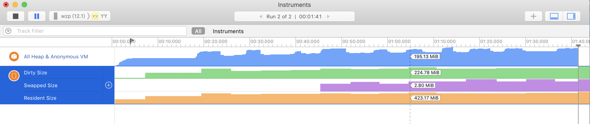

之前手Y中是在使用resident_size来统计app运行时的内存状态，经过与Instruments中的对比，发现差距过大，resident_size的统计会在退出直播间不释放内存、送大礼物等状态时内存一直在增加的情况，容易给开发造成误导。现在已经使用phys_footprint来替代resident_size统计内存状态。

内存分类：

> Clean Memory： 在闪存中有备份，能够再次读取的。主要包括，system framework、binary executable of your app（进程二进制可执行文件，Mach-O文件） 、memory mapped files（内存映射文件）

> Dirty Memory：所有的非Clean Memory，系统无法主动回收的常驻内存，包括Heap allocation、caches、decompressed images

```objc
//内存信息结构体
struct mach_task_basic_info {
        mach_vm_size_t  virtual_size;       /* virtual memory size (bytes) */
        mach_vm_size_t  resident_size;      /* resident memory size (bytes) */
        mach_vm_size_t  resident_size_max;  /* maximum resident memory size (bytes) */
        time_value_t    user_time;          /* total user run time for
                                               terminated threads */
        time_value_t    system_time;        /* total system run time for
                                               terminated threads */
        policy_t        policy;             /* default policy for new threads */
        integer_t       suspend_count;      /* suspend count for task */
};
```

内存之间的关系：

> 虚拟内存：virtual memory = clean memory + dirty memory

> 物理内存：resident memory = dirty memory + clean memory that load in physical memory

> 总的来说，就是：virtual memory == (clean memory + dirty memory) > resident memory > dirty memory

这是Instruments里面某一时刻手Y的内存状态图：



留意到All Heap & Anonymous VM，在这里可以清楚的看到每次进出直播间的内存状态信息，而resident size却不能比较好的反应相关信息。并且在app开发过程中，开发者所能管理的也就是All Heap & Anonymous VM所监测到的内存（dirty memory），resident momory还会包含一部分clean memory，导致信息的不准确。（虽然手Y里面监测的resident_size与上图所显示的Resident Size数值有所差异，但是表现形式基本一致）


来看footprint memory，这是apple关于它的文档：[footprint](https://developer.apple.com/library/archive/technotes/tn2434/_index.html)

> - **Memory Footprint** refers to the total current amount of system memory that is allocated to your app.

另外就是，在我们XNU内核代码中的kern_memorystatus.c文件中，当Jetsam（低内存事件）发生，去kill进程时，拿到该进程所占内存值时，拿到的也是footprint memory：

```objc
static boolean_t
memorystatus_kill_hiwat_proc(uint32_t *errors)
{
	pid_t aPid = 0;
	proc_t p = PROC_NULL, next_p = PROC_NULL;
	boolean_t new_snapshot = FALSE, killed = FALSE;
	int kill_count = 0;
	unsigned int i = 0;
	uint32_t aPid_ep;
	uint64_t killtime = 0;
        clock_sec_t     tv_sec;
        clock_usec_t    tv_usec;
        uint32_t        tv_msec;
	os_reason_t jetsam_reason = OS_REASON_NULL;
	KERNEL_DEBUG_CONSTANT(BSDDBG_CODE(DBG_BSD_MEMSTAT, BSD_MEMSTAT_JETSAM_HIWAT) | DBG_FUNC_START,
		memorystatus_available_pages, 0, 0, 0, 0);
	
	jetsam_reason = os_reason_create(OS_REASON_JETSAM, JETSAM_REASON_MEMORY_HIGHWATER);
	if (jetsam_reason == OS_REASON_NULL) {
		printf("memorystatus_kill_hiwat_proc: failed to allocate exit reason\n");
	}

	proc_list_lock();
	
	next_p = memorystatus_get_first_proc_locked(&i, TRUE);
	while (next_p) {
		uint64_t footprint_in_bytes = 0;
		uint64_t memlimit_in_bytes  = 0;
		boolean_t skip = 0;

		p = next_p;
		next_p = memorystatus_get_next_proc_locked(&i, p, TRUE);
		
		aPid = p->p_pid;
		aPid_ep = p->p_memstat_effectivepriority;
		
		if (p->p_memstat_state  & (P_MEMSTAT_ERROR | P_MEMSTAT_TERMINATED)) {
			continue;
		}
		
		/* skip if no limit set */
		if (p->p_memstat_memlimit <= 0) {
			continue;
		}

        //-------------------拿到的是footprint来进行比较的----------------------
		footprint_in_bytes = get_task_phys_footprint(p->task);
		memlimit_in_bytes  = (((uint64_t)p->p_memstat_memlimit) * 1024ULL * 1024ULL);	/* convert MB to bytes */
		skip = (footprint_in_bytes <= memlimit_in_bytes);

#if CONFIG_JETSAM && (DEVELOPMENT || DEBUG)
		if (!skip && (memorystatus_jetsam_policy & kPolicyDiagnoseActive)) {
			if (p->p_memstat_state & P_MEMSTAT_DIAG_SUSPENDED) {
				continue;
			}
		}
#endif /* CONFIG_JETSAM && (DEVELOPMENT || DEBUG) */

#if CONFIG_FREEZE
		if (!skip) {
			if (p->p_memstat_state & P_MEMSTAT_LOCKED) {
				skip = TRUE;
			} else {
				skip = FALSE;
			}				
		}
#endif

		if (skip) {
			continue;
		} else {
#if CONFIG_JETSAM && (DEVELOPMENT || DEBUG)
			MEMORYSTATUS_DEBUG(1, "jetsam: %s pid %d [%s] - %lld Mb > 1 (%d Mb)\n",
					   (memorystatus_jetsam_policy & kPolicyDiagnoseActive) ? "suspending": "killing",
					   aPid, (*p->p_name ? p->p_name : "unknown"),
					   (footprint_in_bytes / (1024ULL * 1024ULL)), 	/* converted bytes to MB */
					   p->p_memstat_memlimit);
#endif /* CONFIG_JETSAM && (DEVELOPMENT || DEBUG) */
				
			if (memorystatus_jetsam_snapshot_count == 0) {
				memorystatus_init_jetsam_snapshot_locked(NULL,0);
                		new_snapshot = TRUE;
                	}
                	
			p->p_memstat_state |= P_MEMSTAT_TERMINATED;

			killtime = mach_absolute_time();
			absolutetime_to_microtime(killtime, &tv_sec, &tv_usec);
			tv_msec = tv_usec / 1000;
				
#if CONFIG_JETSAM && (DEVELOPMENT || DEBUG)
			if (memorystatus_jetsam_policy & kPolicyDiagnoseActive) {
			        MEMORYSTATUS_DEBUG(1, "jetsam: pid %d suspended for diagnosis - memorystatus_available_pages: %d\n", aPid, memorystatus_available_pages);
				memorystatus_update_jetsam_snapshot_entry_locked(p, kMemorystatusKilledDiagnostic, killtime);
				p->p_memstat_state |= P_MEMSTAT_DIAG_SUSPENDED;
				
				p = proc_ref_locked(p);
				proc_list_unlock();
				if (p) {
					task_suspend(p->task);
					proc_rele(p);
					killed = TRUE;
				}
				
				goto exit;
			} else
#endif /* CONFIG_JETSAM && (DEVELOPMENT || DEBUG) */
			{
				memorystatus_update_jetsam_snapshot_entry_locked(p, kMemorystatusKilledHiwat, killtime);
			        
				if (proc_ref_locked(p) == p) {
					proc_list_unlock();

					os_log_with_startup_serial(OS_LOG_DEFAULT, "%lu.%03d memorystatus: killing_highwater_process pid %d [%s] (highwater %d) - memorystatus_available_pages: %llu\n",
					       (unsigned long)tv_sec, tv_msec, aPid, (*p->p_name ? p->p_name : "unknown"), aPid_ep, (uint64_t)memorystatus_available_pages);

					/*
					 * memorystatus_do_kill drops a reference, so take another one so we can
					 * continue to use this exit reason even after memorystatus_do_kill()
					 * returns
					 */
					os_reason_ref(jetsam_reason);

					killed = memorystatus_do_kill(p, kMemorystatusKilledHiwat, jetsam_reason);

					/* Success? */
					if (killed) {
						proc_rele(p);
						kill_count++;
						goto exit;
					}

					/*
					 * Failure - first unwind the state,
					 * then fall through to restart the search.
					 */
					proc_list_lock();
					proc_rele_locked(p);
					p->p_memstat_state &= ~P_MEMSTAT_TERMINATED;
					p->p_memstat_state |= P_MEMSTAT_ERROR;
					*errors += 1;
				}

				/*
				 * Failure - restart the search.
				 *
				 * We might have raced with "p" exiting on another core, resulting in no
				 * ref on "p".  Or, we may have failed to kill "p".
				 *
				 * Either way, we fall thru to here, leaving the proc in the 
				 * P_MEMSTAT_TERMINATED state.
				 *
				 * And, we hold the the proc_list_lock at this point.
				 */

				i = 0;
				next_p = memorystatus_get_first_proc_locked(&i, TRUE);
			}
		}
	}
	
	proc_list_unlock();
	
exit:
	os_reason_free(jetsam_reason);

	/* Clear snapshot if freshly captured and no target was found */
	if (new_snapshot && !killed) {
		proc_list_lock();
		memorystatus_jetsam_snapshot->entry_count = memorystatus_jetsam_snapshot_count = 0;
		proc_list_unlock();
	}
	
	KERNEL_DEBUG_CONSTANT(BSDDBG_CODE(DBG_BSD_MEMSTAT, BSD_MEMSTAT_JETSAM_HIWAT) | DBG_FUNC_END, 
			      memorystatus_available_pages, killed ? aPid : 0, kill_count, 0, 0);

	return killed;
}
```

其在实际使用的记录中也和Instruments中All Heap & Anonymous VM监测到的值行为一致，数值与dirty memory基本相等，能比较好的展现App的真实内存的状态。
